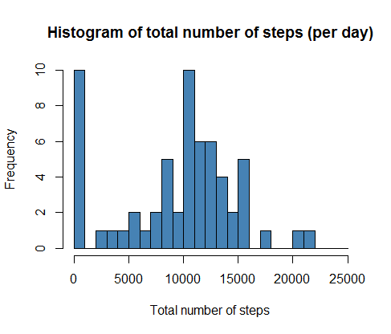
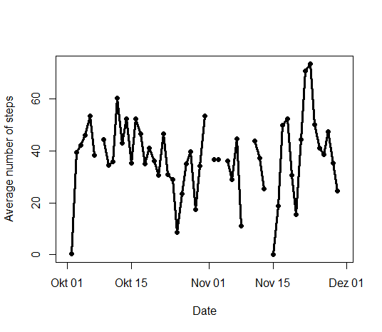
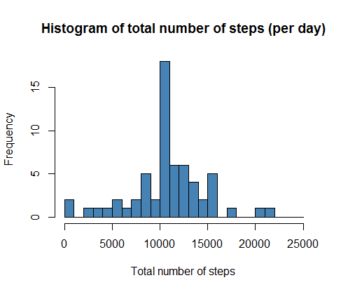
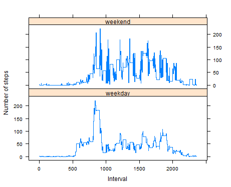

### 1. Loading Data

In the very beginning, we just read in the raw dataset, and ask with command  `str` its structur. 
*Attention:* For reproducibility of the code one should change the working directory properly!
```{r}
setwd("~/Coursera/Reproducible Research/Peer Graded Assignment")
# Loading data
df <- read.csv(file="activity.csv", header=T, sep=",", stringsAsFactors=F)
str(df)
```
Our data consists of 17568 observations and 3 variables, which are `steps`, `date` and `interval`. 
```{r}
'data.frame':      17568 obs. of  3 variables:
 $ steps   : int  NA NA NA NA NA NA NA NA NA NA ...
 $ date    : chr  "2012-10-01" "2012-10-01" "2012-10-01" "2012-10-01" ...
 $ interval: int  0 5 10 15 20 25 30 35 40 45 ...
```

###2. Histogram of the total number of steps (tns) taken each day  
In this part of our analysis we will build a descriptive graphics, like histogramms, boxplots, scatterplots etc.
```{r}
tns <- with(data=df, tapply(steps, date, sum, na.rm=T ))
br <- seq(0, 25000, 1000)
hist(tns, col="steelblue", breaks = br, xlab="Total number of steps",
		 main="Histogram of total number of steps (per day)")
```
The code above execute an aggregation of steps per day and depict the frequency of the results in form of a histogram.
 

###3. Mean and median number of steps taken each day  
Having the information of steps per day at hand, we can easily compute the `mean` and `median` of steps done during the observed days.
```{r}
coef <- c(Mean.of.Steps = mean(tns), Median.of.Steps = median(tns))
coef
```
Additionally one can assign names to each element of computed vector.
```{r}
  Mean.of.Steps Median.of.Steps 
        9354.23        10395.00
```
According to our computation the daily mean of steps in the observed period was 9354.23 and median respectively  10395.00.
###4. Time series plot of the average number of steps taken  

As a next we depict the trend of steps on average from the first till the last day, and link them by line.
```{r}
tns.avg <- with(data=df, tapply(steps, date, mean, na.rm=T))
plot(as.Date(unique(df$date)), tns.avg, t="l", lwd="3",
		 ylab="Average number of steps", xlab="Date")
points(as.Date(unique(df$date)), tns.avg, pch=19)
```
 

The plot above shows that for some days, there was no information available, therefore we see the unusual breaks in the trend.
###5. The 5-minute interval that, on average, contains the maximum number of steps  

Ultimately, it is also possible to compute the average step amount in 5-min. intervalls! For this reason we can use different commands, here we made use of `tapply`.
```{r}
int5min <- with(data=df, tapply(steps, interval, mean, na.rm=T))
max(int5min)
```
```{r}
[1] 206.1698
```
According to our results the maximal step number during 5-min. intervalls contain 206.1698 steps on average!
### Code to describe and show a strategy for imputing missing data
With the command `complete.cases` we can easily extract the lines with complete information, without any `NAs`!
```{r}
sum(!complete.cases(df))
```
According to our computation there were 2304 cases with at least one missing in one of the three variables!
```{r}
[1] 2304
```
```{r, results='hide'}
library(dplyr)
```

```{r}
ix <- is.na(df$steps)
df.m <- tbl_df(df)
df.m <- df.m %>% 
	group_by(interval) %>%
	mutate(avg = mean(steps, na.rm=T)) 
df.m$steps[ix] <- df.m$avg[ix]

tns.m <- with(data=df.m, tapply(steps, date, sum))
hist(tns.m, col="steelblue", breaks = br, xlab="Total number of steps",
		 main="Histogram of total number of steps (per day)")
```
  

Refilling the date by means will change the shape of histogram (compare with the first figure)
```{r}
coef.m <- c(Mean.of.Steps = mean(tns.m), Median.of.Steps = median(tns.m))
coef.m
```
```{r}
  Mean.of.Steps Median.of.Steps 
       10766.19        10766.19 
```      
We can also see, that the artificial refilling of `NAs` by mean values, will lead to higher mean and median of steps per day!
### Are there differences in activity patterns between weekdays and weekends?
Here we convert the dates into weekdays, and then split into two categories `weekend` and `weekdays`.
```{r}
wd <-weekdays(as.Date(df$date))
names <- names(table(wd))

dummy <- as.factor(wd == names[6:7])
levels(dummy) <- c("weekday", "weekend")
table(dummy)
```
```{r}
weekday weekend 
  15264    2304 
```  
According to our computation there were 15264 weekdays and 2304 weekends!
At the and we make use of command `xyplot` from `lattice` package, which is espesically good by plotting many graphs! 
```{r}
df.m <- cbind(df.m, dummy) 
library(lattice)
df.n <- df.m %>%
	group_by(dummy, interval) %>%
	mutate(m = mean(steps))

xyplot(data=df.n, m~interval|dummy, layout=c(1, 2), t="s", 
			 ylab="Number of steps", xlab="Interval")
```
 
